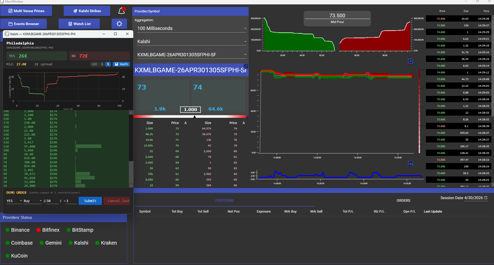
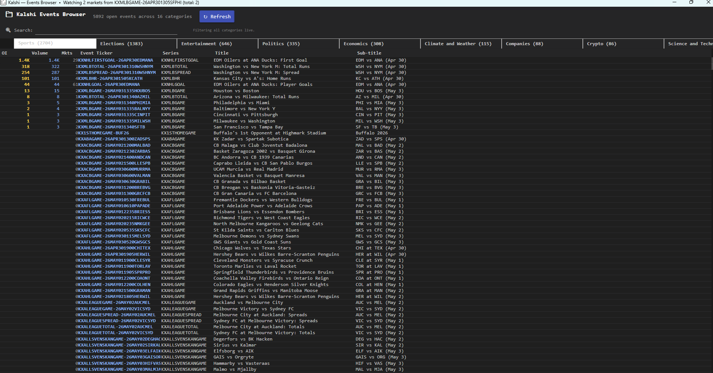

# VisualHFT-Kalshi

A fork of [silahian/VisualHFT](https://github.com/silahian/VisualHFT) that
adds **[Kalshi](https://kalshi.com/) prediction-market** support: a real-time
data plugin, an Events Browser, a Watch List, a Strike Ladder UI, and a
demo-only order panel — all built on top of VisualHFT's existing market-
microstructure rendering pipeline.

```
VisualHFT-Kalshi/
├── VisualHFT/             # Forked WPF app (silahian/VisualHFT + Kalshi UI)
└── visualhft-kalshi/      # MarketConnectors.Kalshi plugin (signer, WS, REST polling)
```

## Screenshots

### Main window



VisualHFT running with the Kalshi plugin loaded. Top toolbar exposes Kalshi
entry points (**Multi Venue Prices**, **Kalshi Strikes**, **Events Browser**,
**Watch List**). The floating ladder shows a per-market view of an MLB strike
contract (`KXMLBGAME-26APR301305SFPHI-PHI` — Philadelphia, YES 26¢ / NO 72¢,
2¢ spread) with a cumulative-depth chart and a price ladder rendered with
the same `OrderBook` bus the rest of the app uses. The center pane shows the
provider/symbol picker, mid-price tile, and live depth ladder; the right
pane is the standard VisualHFT depth chart, best-bid/offer time series,
spread chart, and live trade tape. Bottom strip is a demo-only order panel
(safety-capped at 5 contracts/order). Kalshi appears in the **Providers'
Status** row alongside the existing crypto venues.

### Events Browser



Live catalog of every open Kalshi event grouped by the API's `category`
field — Sports (2,704), Elections (1,383), Entertainment (646), Politics
(335), Economics (308), Climate & Weather, Companies, Crypto, Science &
Tech, etc. Type-ahead search filters across **all** categories
simultaneously. Each event shows aggregate open interest, volume, and
market count; double-click an event to start streaming its markets into
the live ladder without editing the plugin's static ticker list.

## Quickstart

### 1. Prerequisites

- **Windows** (the WPF app targets `net10.0-windows`)
- **.NET 10 SDK** — `dotnet --list-sdks` should show ≥ `10.0.203`
- **OxyPlot** cloned as a sibling of the `VisualHFT/` subfolder. The csproj
  expects it at `VisualHFT/../oxyplot/`:
  ```bash
  git clone https://github.com/oxyplot/oxyplot.git oxyplot
  ```
  (`oxyplot/` is gitignored from this repo so it stays out of the public
  history; you clone it locally next to `VisualHFT/`.)

### 2. Set Kalshi credentials

Generate an API key at <https://kalshi.com> (or <https://demo.kalshi.co> for
demo) → Profile → **API Keys** → **Create new API key**. Save the private
key Kalshi shows you (one-time display) and the key id somewhere outside
this repo.

Then set the env vars before launching:

```powershell
# Demo (used by the in-app order panel + plugin defaults)
$env:KALSHI_DEMO_KEY_ID   = "<your demo key id>"
$env:KALSHI_DEMO_PEM_PATH = "C:\path\to\your\kalshi-demo.pem"

# Prod (used by the read-only Events Browser / Strike Ladder)
$env:KALSHI_PROD_KEY_ID   = "<your prod key id>"
$env:KALSHI_PROD_PEM_PATH = "C:\path\to\your\kalshi-prod.pem"
```

The credential reader and error messages live in
[`VisualHFT/Helpers/KalshiCredentials.cs`](VisualHFT/Helpers/KalshiCredentials.cs).

### 3. Build & run

```bash
# Build the plugin (drops MarketConnectors.Kalshi.dll in its bin/)
cd visualhft-kalshi
dotnet build

# Build the WPF app
cd ../VisualHFT
dotnet build VisualHFT.csproj

# Copy the plugin DLL into VisualHFT's output folder
cp ../visualhft-kalshi/src/MarketConnectors.Kalshi/bin/Debug/net10.0-windows/MarketConnectors.Kalshi.dll \
   bin/Debug/net10.0-windows/

# Launch
./bin/Debug/net10.0-windows/VisualHFT.exe
```

The Kalshi plugin will appear in VisualHFT's connector list. Toggle it on,
configure the ticker in settings, and live order books render on screen.

## Subprojects

- [`VisualHFT/`](VisualHFT/README.md) — forked WPF app with Kalshi-aware
  Helpers, Browser, Watch List, Strike Ladder.
- [`visualhft-kalshi/`](visualhft-kalshi/README.md) — Kalshi data plugin
  (signer, REST/WS clients, settings).

## Licenses

- `VisualHFT/` retains the upstream **Apache 2.0** license — see
  [`VisualHFT/LICENSE.txt`](VisualHFT/LICENSE.txt).
- `visualhft-kalshi/` is **MIT**.

## Credits

- Upstream VisualHFT by [silahian](https://github.com/silahian) — the entire
  microstructure rendering, plugin loader, OxyPlot wiring, and trigger engine
  are theirs. This fork only adds Kalshi-specific UI/data wiring on top.
