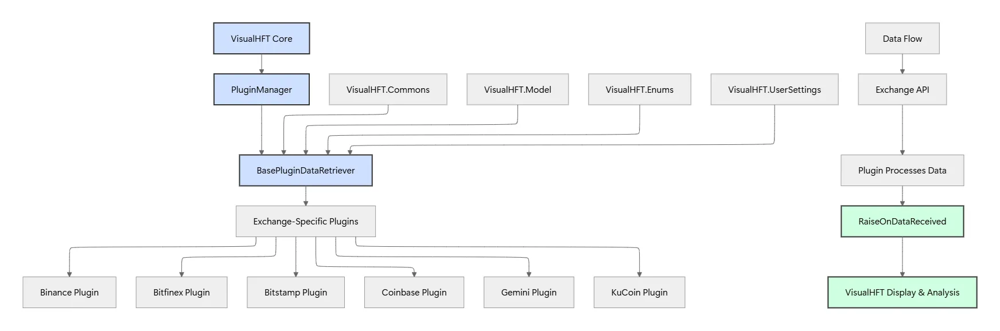

# VisualHFT — System Architecture

An overview of how VisualHFT is put together, from the WPF UI down to the
plugin ecosystem.



## Contents

1. [Architecture: the three tiers](#architecture-the-three-tiers)
2. [Data flow: the pub/sub bus](#data-flow-the-pubsub-bus)
3. [Performance engineering](#performance-engineering)
4. [Plugin ecosystem](#plugin-ecosystem)
5. [Anatomy of a study: VPIN](#anatomy-of-a-study-vpin)
6. [Tech stack & dependencies](#tech-stack--dependencies)

---

## Architecture: the three tiers

### 1. Presentation Layer (WPF)

The user-facing GUI, built with a strict MVVM pattern. Views (`.xaml`) are
decoupled from logic (`ViewModels`), with property-change notifications
automated by Fody for clean, maintainable code.

### 2. Core Services Engine

The central nervous system. Manages the plugin lifecycle (`PluginManager`)
and orchestrates data flow via a high-speed, in-memory pub/sub data bus
implemented as singleton `Helper` classes.

### 3. Plugin Ecosystem

Dynamically loaded DLLs that extend functionality. **Data Retriever** plugins
connect to external sources; **Study** plugins perform real-time analytics on
the data flowing through the bus.

---

## Data flow: the pub/sub bus

Data flows unidirectionally from producers to consumers via a decoupled,
event-driven bus. Singleton `Helper` classes act as channels — producers
push, consumers subscribe — which keeps the system modular and responsive.

```
[ Data Retriever Plugin ]  →  [ Helper / Data Bus ]  →  [ UI + Study Plugins ]
       (producer)                  (channel)                  (consumers)
```

Concrete helpers in the codebase: `HelperOrderBook`, `HelperTrade`,
`HelperSymbol`, etc. Each is a process-wide singleton exposing
`UpdateData(...)` for producers and `OnDataReceived` for subscribers.

---

## Performance engineering

### Concurrency: `BlockingCollection<T>`

The system uses `BlockingCollection<T>` for its core producer-consumer
queue. This provides an efficient, thread-safe mechanism for passing data
from data-retriever threads to consumer threads without manual locking,
eliminating contention and reducing CPU overhead.

### Memory: custom object pools

To minimize garbage-collector pressure and prevent unpredictable latency
spikes, the platform uses custom object pools. Frequently allocated
objects like `Trade` and `OrderBookUpdate` are recycled instead of being
newly allocated, dramatically reducing memory churn.

### Optimized LOB data structure

The Limit Order Book combines three structures to keep all critical
operations cheap:

| Structure | Purpose | Complexity |
|---|---|---|
| `SortedDictionary<decimal, IOrderBookLevel>` | Price-level lookup | O(log M) |
| `LinkedList<Order>` per price | FIFO add/remove at a level | O(1) |
| `Dictionary<string, Order>` | Direct order lookup | O(1) cancel/update |

---

## Plugin ecosystem

The `PluginManager` orchestrates the entire ecosystem. At startup it scans
the plugin directory, uses reflection to find every type implementing
`IPlugin`, and manages each one's lifecycle (`Initialize`, `Start`, `Stop`).

### Data Retriever plugin

Connects to a data source (FIX, WebSocket, REST, etc.), parses the native
format, and publishes standardized `Model` objects to the data bus.

### Study plugin

Subscribes to data from the bus, performs calculations (e.g., VPIN, LOB
imbalance, market resilience) on a separate thread, and publishes results
back to the bus for UI consumption.

---

## Anatomy of a study: VPIN

A `VPINStudy` plugin demonstrates the platform's analytical model. It is a
stateful, event-driven component that turns raw trades into the
Volume-synchronized Probability of Informed Trading indicator:

1. Subscribe to `OnTrade` events from the `HelperTrade` data bus.
2. Classify each incoming trade as buy or sell (e.g., using the Tick Rule).
3. Add classified volume to the current volume bucket.
4. When a bucket fills: calculate imbalance, append to the rolling window.
5. Recompute VPIN from the rolling window.
6. Publish the new VPIN value to the data bus for UI consumption.

---

## Tech stack & dependencies

### Core stack

| | |
|---|---|
| Framework | .NET 10 (`net10.0-windows`) — was .NET 7 historically |
| Language | C# |
| UI | Windows Presentation Foundation (WPF) |
| Pattern | Model-View-ViewModel (MVVM) |
| Platform | Windows only |

### Key dependencies

| Package | License | Notes |
|---|---|---|
| `Prism.Core` | Dual (Community / Commercial) | Has implications for enterprise adoption |
| `OxyPlot.SkiaSharp.Wpf` | MIT | Charts |
| `Fody` / `PropertyChanged.Fody` | MIT | Automatic INotifyPropertyChanged weaving |
| `log4net` | Apache 2.0 | Logging |
| `MaterialDesignThemes` (+ MahApps) | MIT | Theme |
| `Newtonsoft.Json` | MIT | JSON |
